<p align="center">
  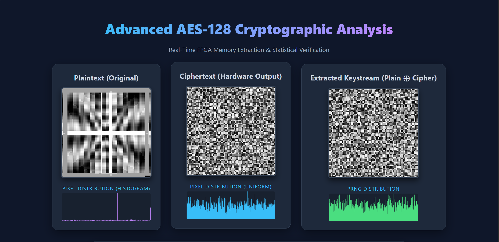
</p>

<h1 align="center">🔐 AES-128 Image Encryption Hardware Accelerator</h1>

<p align="center">
  <strong>A FIPS-197 Compliant Cryptographic IP Core on Xilinx Artix-7 FPGA</strong>
</p>

<p align="center">
  
  
  
  
  
  
</p>

<p align="center">
  <em>End-to-end hardware-accelerated image encryption with real-time JTAG-based cryptographic verification dashboard, <br/>synthesized and validated on Digilent Nexys 4 DDR (xc7a100tcsg324-1)</em>
</p>

---

## 📋 Table of Contents

- [Overview](#-overview)
- [Key Features](#-key-features)
- [System Architecture](#-system-architecture)
- [Hardware Accelerator Pipeline](#-hardware-accelerator-pipeline)
- [AES-128 IP Core Microarchitecture](#-aes-128-ip-core-microarchitecture)
- [Project Structure](#-project-structure)
- [AXI4-Lite Register Map](#-axi4-lite-register-map)
- [FPGA Implementation Results](#-fpga-implementation-results)
- [Cryptographic Validation](#-cryptographic-validation)
- [Getting Started](#-getting-started)
- [Real-Time Dashboard](#-real-time-dashboard)
- [Hardware Demo](#-hardware-demo)
- [Troubleshooting](#-troubleshooting)
- [References](#-references)
- [License](#-license)

---

## 🎯 Overview

This project implements a **complete hardware-accelerated AES-128 CTR-mode image encryption system** on the Digilent Nexys 4 DDR FPGA. At its core is a custom-designed, fully synthesizable **AES-128 encryption engine** (FIPS-197 compliant) packaged as a reusable Vivado IP core with an **AXI4-Lite slave interface**. The accelerator is integrated into a MicroBlaze soft-processor SoC, enabling real-time image encryption with automated verification against a software golden reference.

> **Why CTR Mode?** Counter mode transforms the block cipher into a stream cipher — only the encryption direction is needed (no inverse S-box or inverse MixColumns), making decryption trivially symmetric. CTR also eliminates the ECB pattern-leakage vulnerability, as each block is XORed with a unique keystream derived from an incrementing counter.

### What Makes This a Hardware Accelerator?

| Aspect | Software-Only | This Hardware Accelerator |
|--------|--------------|--------------------------|
| **AES Engine** | CPU instruction loop | Dedicated RTL datapath |
| **Latency** | ~100+ cycles/block (CPU) | **12 cycles/block** (fixed pipeline) |
| **Throughput** | Sequential, cache-dependent | **Deterministic, wire-speed** |
| **Key Expansion** | Computed per-block | **Combinational, single-cycle** |
| **Integration** | Library call | **Memory-mapped AXI peripheral** |
| **Reusability** | Platform-specific binary | **Portable Verilog IP core** |

---

## ✨ Key Features

- 🔒 **FIPS-197 Compliant** — Full AES-128 implementation with all 10 rounds, S-box, ShiftRows, MixColumns, and key expansion
- ⚡ **12-Cycle Latency** — Deterministic encryption pipeline: 1 cycle key expansion + 11 round iterations
- 🔌 **AXI4-Lite Interface** — Standard AMBA bus integration for seamless SoC connectivity
- 🖼️ **Image Encryption** — Real-time 64×64 grayscale image encryption (256 AES blocks) with visual verification
- 📊 **Cryptographic Dashboard** — Live HTML dashboard with entropy analysis, histogram equalization, and statistical quality indicators
- 🔄 **One-Command Build** — Complete TCL automation: IP packaging → Block Design → Address assignment
- ✅ **Byte-Perfect Verification** — Automated comparison against Python `cryptography` library golden reference
- 🎛️ **JTAG Memory Access** — Direct BRAM read/write via Xilinx XSCT for automated test pipelines


---

## 🏗️ System Architecture

<p align="center">
  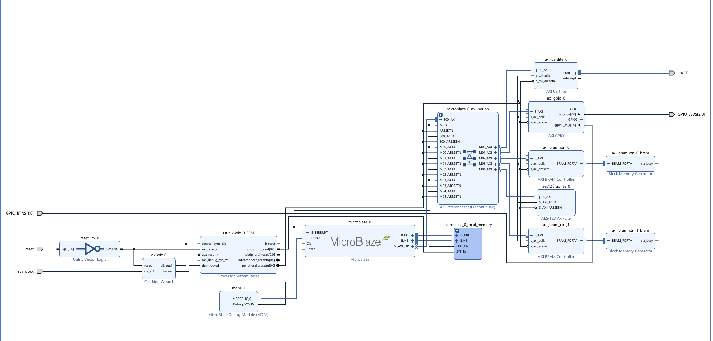
</p>
<p align="center"><em>Fig 1. Vivado IP Integrator Block Design — MicroBlaze SoC with custom AES-128 AXI-Lite accelerator</em></p>

The system is built around a **MicroBlaze soft-processor** orchestrating data flow between memory-mapped peripherals over an AXI4 interconnect:

```
┌─────────────────────────────────────────────────────────────────────┐
│                        Nexys 4 DDR FPGA                            │
│                                                                     │
│   ┌──────────┐     AXI4 Interconnect      ┌──────────────────┐     │
│   │          │◄──────────────────────────► │  AES-128 IP Core │     │
│   │          │                             │  (AXI4-Lite)     │     │
│   │ Micro-   │◄───────────────┐            │  12-cycle engine │     │
│   │ Blaze    │                │            └──────────────────┘     │
│   │ CPU      │◄───┐           │                                     │
│   │          │    │           │            ┌──────────────────┐     │
│   └──────────┘    │           └──────────► │  Input BRAM      │     │
│                   │                        │  (8KB, COE init) │     │
│                   │                        └──────────────────┘     │
│                   │                                                 │
│                   │                        ┌──────────────────┐     │
│                   │           ┌───────────►│  Output BRAM     │     │
│                   │           │            │  (8KB)           │     │
│                   │           │            └──────────────────┘     │
│                   │           │                                     │
│                   └───────────┘            ┌──────────────────┐     │
│                                   ┌───────►│  AXI GPIO        │     │
│                                   │        │  LEDs + Buttons  │     │
│                                   │        └──────────────────┘     │
└───────────────┬───────────────────┼─────────────────────────────────┘
                │                   │
       ┌────────▼────────┐    ┌─────▼────┐
       │  Host PC        │    │  BTNC    │
       │  JTAG (XSCT)    │    │  LED16   │
       │  Python Scripts  │    └──────────┘
       └─────────────────┘
```

---

## 🔄 Hardware Accelerator Pipeline

The following flowchart illustrates the complete encryption pipeline — from image loading to cryptographic verification:

```mermaid
flowchart TD
    A["🖼️ Input Image<br/>(64×64 grayscale)"] --> B["📦 Preprocess<br/>Python: preprocess_image.py"]
    B --> C["💾 .COE File<br/>BRAM Initialization"]
    C --> D["⚙️ Vivado Synthesis<br/>+ Implementation"]
    D --> E["📥 Bitstream → FPGA<br/>Program Device"]
    E --> F["🎛️ MicroBlaze Boot<br/>Wait for BTNC press"]
    
    F --> G{"🔘 Button<br/>Pressed?"}
    G -->|No| F
    G -->|Yes| H["🔑 Load AES Key<br/>to IP Core registers"]
    
    H --> I["📖 Read Block from<br/>Input BRAM"]
    I --> J["🔢 Write Counter<br/>to AES IP"]
    J --> K["⚡ AES-128 Encrypt<br/>(12 clock cycles)"]
    K --> L["🔐 XOR Keystream<br/>⊕ Plaintext"]
    L --> M["💾 Write Cipher<br/>to Output BRAM"]
    M --> O["➕ Increment<br/>Counter"]
    
    O --> P{"All 256<br/>blocks?"}
    P -->|No| I
    P -->|Yes| Q["✅ LED16_G ON<br/>Encryption Complete"]
    
    Q --> R["🖥️ JTAG Extract<br/>multi_image_demo.py"]
    R --> S["🔍 Verify vs Golden<br/>compare_results.py"]
    S --> T["📊 Dashboard<br/>Entropy + Histogram"]

    style A fill:#4a9eff,stroke:#333,color:#fff
    style K fill:#ff6b6b,stroke:#333,color:#fff
    style Q fill:#51cf66,stroke:#333,color:#fff
    style T fill:#cc5de8,stroke:#333,color:#fff
```

---

## 🧠 AES-128 IP Core Microarchitecture

The hardware accelerator implements the full FIPS-197 AES-128 algorithm as a **3-state FSM** with combinational round logic:

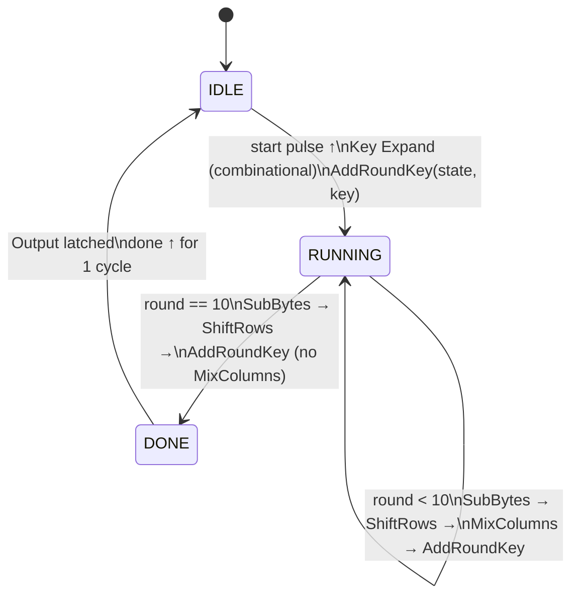

### Round Function Datapath

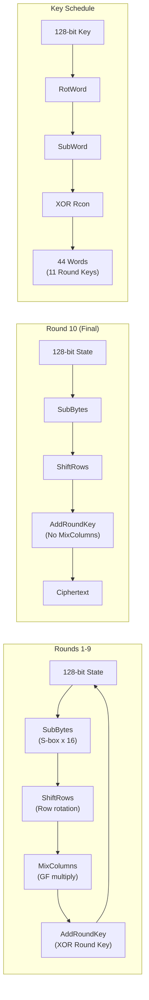

### CTR Mode Operation

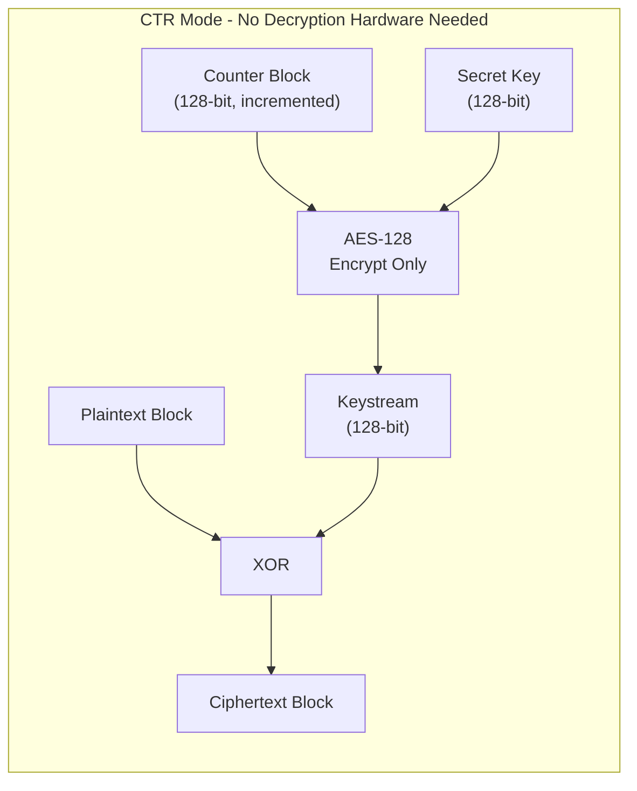

> **Implementation Detail:** The entire key schedule (44 words, 1408 bits) is expanded **combinationally** in a single clock cycle using a Verilog `task`. This trades area for latency — the expanded keys are stored in a 1408-bit register and indexed per round.


---

## 📁 Project Structure

```
aes128_image_encryption_ipcore_nexys4ddr/
│
├── 📂 hw/                              ← Hardware Design
│   ├── 📂 ip/aes128_axilite/
│   │   ├── 📂 hdl/
│   │   │   ├── aes128_core.v           ← AES-128 FIPS-197 encryption engine (307 lines)
│   │   │   └── aes128_axilite_wrapper.v ← AXI4-Lite slave interface (237 lines)
│   │   ├── component.xml               ← Vivado IP-XACT descriptor
│   │   └── 📂 xgui/                    ← IP Customization GUI
│   ├── 📂 constraints/
│   │   └── nexys4ddr_image_crypto.xdc  ← Pin assignments (GPIO, buttons)
│   └── 📂 vivado/
│       └── create_project.tcl          ← One-command project builder (282 lines)
│
├── 📂 sw/                              ← Firmware
│   └── 📂 microblaze/
│       ├── main.c                      ← CTR-mode encryption firmware (190 lines)
│       └── aes_ip_driver.h             ← AXI register access driver (126 lines)
│
├── 📂 scripts/                         ← Host-Side Automation
│   ├── preprocess_image.py             ← Any image → 64×64 grayscale → .COE
│   ├── software_reference_ctr.py       ← Golden reference generator (PyCryptodome)
│   ├── reconstruct_image.py            ← Raw cipher bytes → PNG visualization
│   ├── compare_results.py             ← Byte-level FPGA vs golden verification
│   ├── generate_demo_image.py          ← Synthetic test pattern generator
│   ├── pack_coe.py                     ← Raw binary → Vivado .COE format
│   └── requirements.txt               ← Python dependencies
│
├── 📂 sample_assets/                   ← Pre-built Test Vectors
│   ├── sample_64x64_gradient.png       ← Original test image
│   ├── sample_64x64_gradient.raw       ← Raw 4096 bytes
│   ├── sample_64x64_gradient.coe       ← BRAM initialization file
│   └── sample_64x64_gradient_encrypted_ctr.raw  ← Golden reference output
│
├── 📂 report_images/                   ← Documentation Assets
│   ├── block_design.png                ← Vivado block design screenshot
│   ├── schematic.png                   ← Top-level RTL schematic
│   ├── dashboard_image.png             ← Cryptographic analysis dashboard
│   ├── dashboard_stats.png             ← Statistical quality indicators panel
│   ├── hardware_1.jpg                  ← Lab setup photo (board + dashboard)
│   ├── hardware_2.jpg                  ← Lab setup photo (statistics panel)
│   ├── report_utilization.png          ← FPGA resource utilization
│   ├── report_timing.png              ← Timing analysis summary
│   ├── report_power.png               ← Power analysis report
│   ├── project_summary.png            ← Vivado project summary
│   ├── vitis_project.png              ← Vitis IDE build success
│   └── python_terminal.png            ← Dashboard automation terminal
│
├── multi_image_demo.py                 ← ⭐ Multi-image JTAG automated pipeline
└── README.md                           ← This file
```

---

## 📝 AXI4-Lite Register Map

The AES-128 IP core exposes a simple, flat register interface for software control:

| Offset | Name | Access | Width | Description |
|:------:|:----:|:------:|:-----:|:------------|
| `0x00` | **CTRL** | W | 32 | `bit[0]` = START pulse, `bit[1]` = SOFT_RST |
| `0x04` | **STATUS** | R | 32 | `bit[0]` = DONE (latched until next START) |
| `0x08` | **KEY_W0** | W | 32 | AES Key `[127:96]` |
| `0x0C` | **KEY_W1** | W | 32 | AES Key `[95:64]` |
| `0x10` | **KEY_W2** | W | 32 | AES Key `[63:32]` |
| `0x14` | **KEY_W3** | W | 32 | AES Key `[31:0]` |
| `0x18` | **DIN_W0** | W | 32 | Data Input `[127:96]` |
| `0x1C` | **DIN_W1** | W | 32 | Data Input `[95:64]` |
| `0x20` | **DIN_W2** | W | 32 | Data Input `[63:32]` |
| `0x24` | **DIN_W3** | W | 32 | Data Input `[31:0]` |
| `0x28` | **DOUT_W0** | R | 32 | Data Output `[127:96]` |
| `0x2C` | **DOUT_W1** | R | 32 | Data Output `[95:64]` |
| `0x30` | **DOUT_W2** | R | 32 | Data Output `[63:32]` |
| `0x34` | **DOUT_W3** | R | 32 | Data Output `[31:0]` |

**Base Address:** `0x44A0_0000` (configured in TCL automation)


---

## 📊 FPGA Implementation Results

### Resource Utilization

<p align="center">
  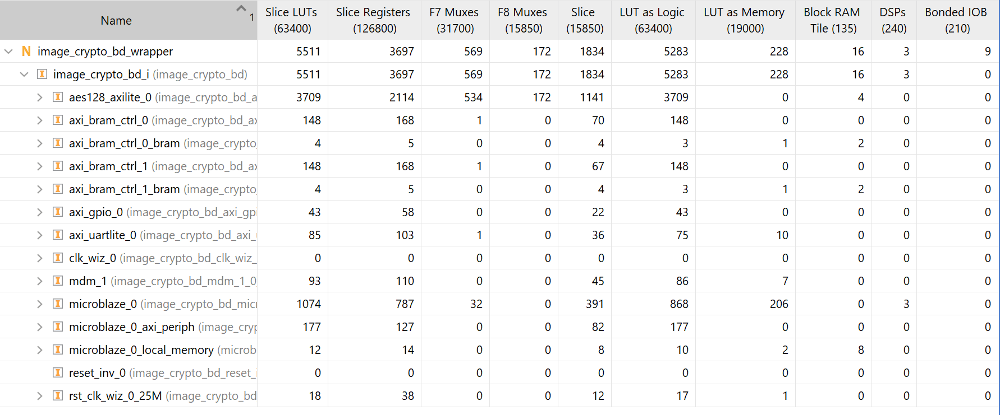
</p>
<p align="center"><em>Fig 2. Post-implementation hierarchical resource utilization (Vivado 2024.2)</em></p>

| Resource | Used | Available | Utilization |
|:---------|:----:|:---------:|:-----------:|
| **Slice LUTs** | 5,511 | 63,400 | 8.7% |
| **Slice Registers** | 3,697 | 126,800 | 2.9% |
| **Block RAM Tiles** | 16 | 135 | 11.9% |
| **DSPs** | 3 | 240 | 1.3% |
| **F7 Muxes** | 569 | 31,700 | 1.8% |
| **Bonded IOBs** | 9 | 210 | 4.3% |

> **AES Core Alone:** 3,709 LUTs, 2,114 Registers, 4 BRAMs — a compact, area-efficient implementation suitable for resource-constrained embedded systems.

### Timing Analysis

<p align="center">
  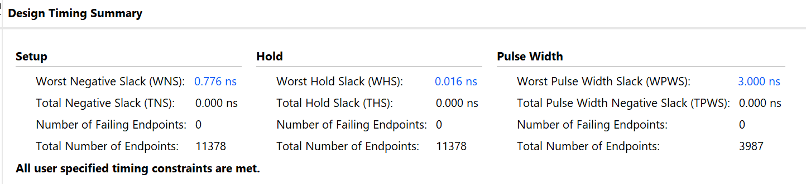
</p>
<p align="center"><em>Fig 3. Design timing summary — all constraints met with positive slack</em></p>

| Metric | Value | Status |
|:-------|:-----:|:------:|
| **Worst Negative Slack (WNS)** | 0.776 ns | ✅ Met |
| **Worst Hold Slack (WHS)** | 0.016 ns | ✅ Met |
| **Worst Pulse Width Slack** | 3.000 ns | ✅ Met |
| **Failing Endpoints** | 0 | ✅ |
| **Total Endpoints** | 11,378 | — |

### Power Analysis

<p align="center">
  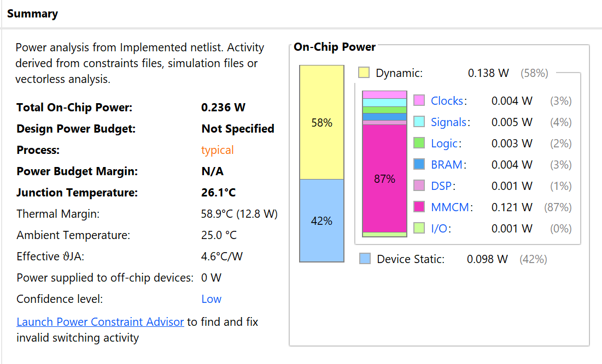
</p>
<p align="center"><em>Fig 4. On-chip power breakdown — total 0.236 W</em></p>

| Component | Power | Percentage |
|:----------|:-----:|:----------:|
| **Total On-Chip** | 0.236 W | 100% |
| Dynamic | 0.138 W | 58% |
| Device Static | 0.098 W | 42% |
| **Junction Temp** | 26.1 C | — |

---

## 🔍 Cryptographic Validation

### Visual Proof: Plaintext → Ciphertext → Keystream

<p align="center">
  
</p>
<p align="center"><em>Fig 5. Real-time cryptographic analysis dashboard showing plaintext, hardware ciphertext, and extracted keystream with pixel distribution histograms</em></p>

### Observed Statistical Indicators

> **Note:** The metrics below are lightweight observational indicators computed by our dashboard — they are **not** a formal NIST SP 800-22 randomness test suite. They serve as practical sanity checks for ciphertext quality.

<p align="center">
  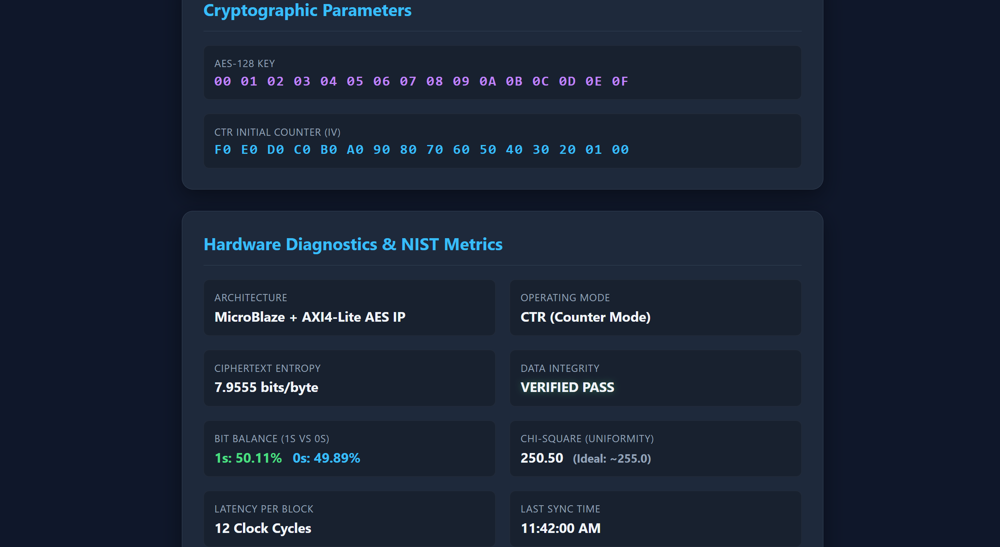
</p>
<p align="center"><em>Fig 6. Hardware diagnostics and statistical quality indicators</em></p>

| Metric | Measured | Ideal | Verdict |
|:-------|:--------:|:-----:|:-------:|
| **Shannon Entropy** | 7.9555 bits/byte | 8.0 | ✅ Near-ideal randomness |
| **Bit Balance (1s)** | 50.11% | 50.0% | ✅ Balanced |
| **Bit Balance (0s)** | 49.89% | 50.0% | ✅ Balanced |
| **Chi-Square** | 250.50 | ~255.0 | ✅ Uniform distribution |
| **Data Integrity** | VERIFIED PASS | — | ✅ Byte-perfect match |

### Encryption Visualization

| Original (Plaintext) | Encrypted (Ciphertext) |
|:--------------------:|:---------------------:|
| 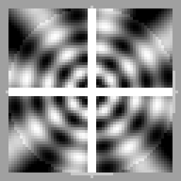 | 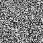 |
| Structured gradient pattern | Pseudorandom noise (ideal) |

### Demo Parameters

| Parameter | Value |
|:----------|:------|
| **Image** | 64x64 grayscale (4,096 bytes, 256 AES blocks) |
| **AES Key** | `00 01 02 03 04 05 06 07 08 09 0A 0B 0C 0D 0E 0F` |
| **Initial Counter (IV)** | `F0 E0 D0 C0 B0 A0 90 80 70 60 50 40 30 20 10 00` |
| **Data Extraction** | JTAG (XSCT `mrd` command) |
| **Input BRAM** | `0xC000_0000` (8 KB) |
| **Output BRAM** | `0xC200_0000` (8 KB) |
| **AES IP Base** | `0x44A0_0000` (4 KB) |


---

## 🚀 Getting Started

### Prerequisites

| Tool | Version | Purpose |
|:-----|:--------|:--------|
| **Vivado** | 2024.2 | Synthesis, implementation, bitstream |
| **Vitis Unified IDE** | 2024.2 | MicroBlaze firmware development |
| **Python** | 3.8+ | Host scripts, verification, dashboard |
| **Hardware** | Nexys 4 DDR | Target FPGA board |

### Phase 0 — Install Python Dependencies

```bash
pip install -r scripts/requirements.txt
```

### Phase 1 — Generate Golden Reference (Optional)

> The golden reference is pre-included in `sample_assets/`. Run only if you change the key or counter.

```bash
python scripts/software_reference_ctr.py sample_assets/sample_64x64_gradient.raw \
    --output sample_assets/sample_64x64_gradient_encrypted_ctr.raw

python scripts/reconstruct_image.py sample_assets/sample_64x64_gradient_encrypted_ctr.raw \
    --output sample_assets/golden_encrypted.png
```

### Phase 2 — Build Vivado Project (One Command)

```tcl
# In Vivado 2024.2 TCL Console:
cd {/path/to/aes128_image_encryption_ipcore_nexys4ddr}
source hw/vivado/create_project.tcl
```

This single script automates:
1. ✅ AES-128 IP packaging with AXI4-Lite interface
2. ✅ Vivado project creation for xc7a100tcsg324-1
3. ✅ Complete block design assembly (MicroBlaze + AES + BRAMs + GPIO)
4. ✅ Address map configuration
5. ✅ HDL wrapper generation

### Phase 3 — Synthesize & Implement

In Vivado Flow Navigator:
1. **Run Synthesis** → wait (~5-10 min)
2. **Run Implementation** → wait (~10-15 min)
3. **Generate Bitstream** → wait (~5 min)

### Phase 4 — Export & Build Firmware

1. **File → Export → Export Hardware** (include bitstream)
2. Open **Vitis Unified IDE**
3. Create platform from `.xsa` file
4. Import `sw/microblaze/main.c` and `aes_ip_driver.h`
5. **Build** → 0 errors expected

<p align="center">
  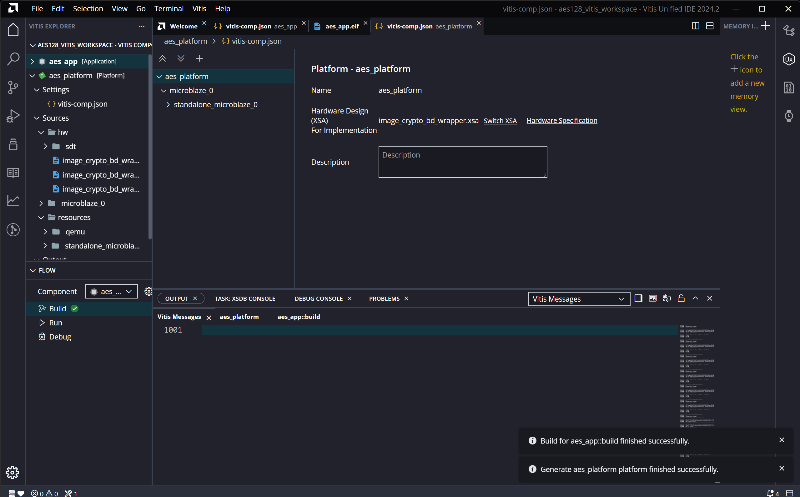
</p>
<p align="center"><em>Fig 7. Vitis Unified IDE — successful build of AES firmware application</em></p>

### Phase 5 — Program & Run

1. Connect Nexys 4 DDR via USB-JTAG
2. **Program Device** in Vitis
3. **Run → Launch Hardware**
4. Press **BTNC** (center button) to trigger encryption
5. LED16 turns **Red** (encrypting) → **Green** (done)

### Phase 6 — Extract & Verify (JTAG)

The project uses **JTAG-based BRAM extraction** via Xilinx XSCT for reliable, automated data capture:

```bash
# Run the full multi-image automated pipeline
python multi_image_demo.py
```

This script automatically:
1. ✅ Uploads image data to Input BRAM via JTAG
2. ✅ Triggers encryption on the MicroBlaze
3. ✅ Extracts ciphertext from Output BRAM via JTAG
4. ✅ Compares against the software golden reference
5. ✅ Generates an HTML dashboard with visual + statistical analysis

Expected output:
```
✅  PERFECT MATCH — FPGA output is cryptographically correct!
```

---

## 📡 Real-Time Dashboard

The project includes an automated JTAG-based pipeline (`multi_image_demo.py`) that uploads images, triggers encryption, extracts BRAM contents directly from the FPGA, and generates a live HTML cryptographic analysis report:

<p align="center">
  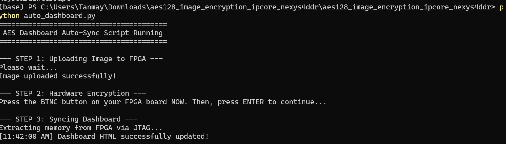
</p>
<p align="center"><em>Fig 8. Multi-image demo pipeline — JTAG upload, encrypt, extract, visualize</em></p>

```bash
python multi_image_demo.py
```

The dashboard computes and displays:
- **Plaintext vs. Ciphertext** side-by-side with pixel-level rendering
- **Extracted Keystream** (Plain XOR Cipher) visualization
- **Pixel Distribution Histograms** for all three views
- **Shannon Entropy** of ciphertext (ideal: 8.0 bits/byte)
- **Bit Balance Test** (50/50 split of 1s and 0s)
- **Chi-Square Uniformity Test** (ideal: ~255.0 for 256 bins)

---

## 🔬 Hardware Demo

<p align="center">
  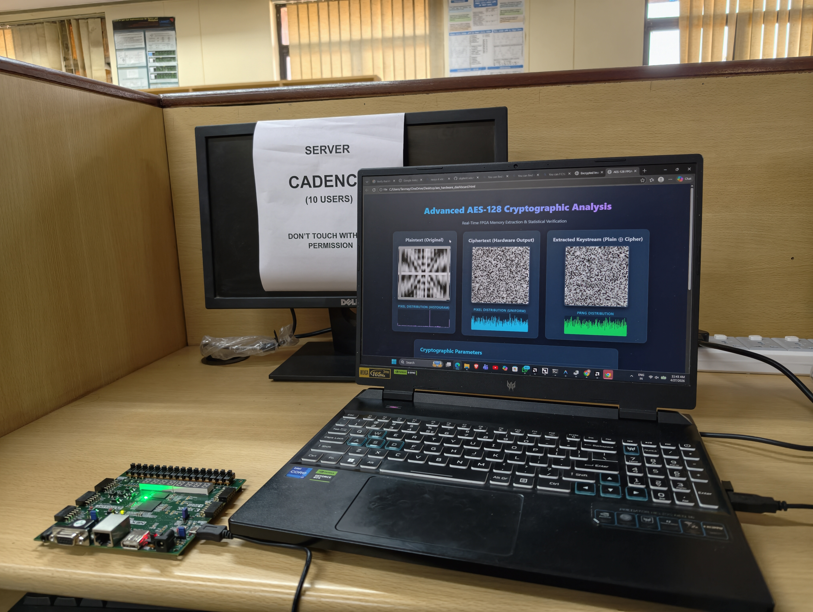
</p>
<p align="center"><em>Fig 9. Lab demonstration setup — Nexys 4 DDR FPGA connected to host running the cryptographic analysis dashboard</em></p>

<p align="center">
  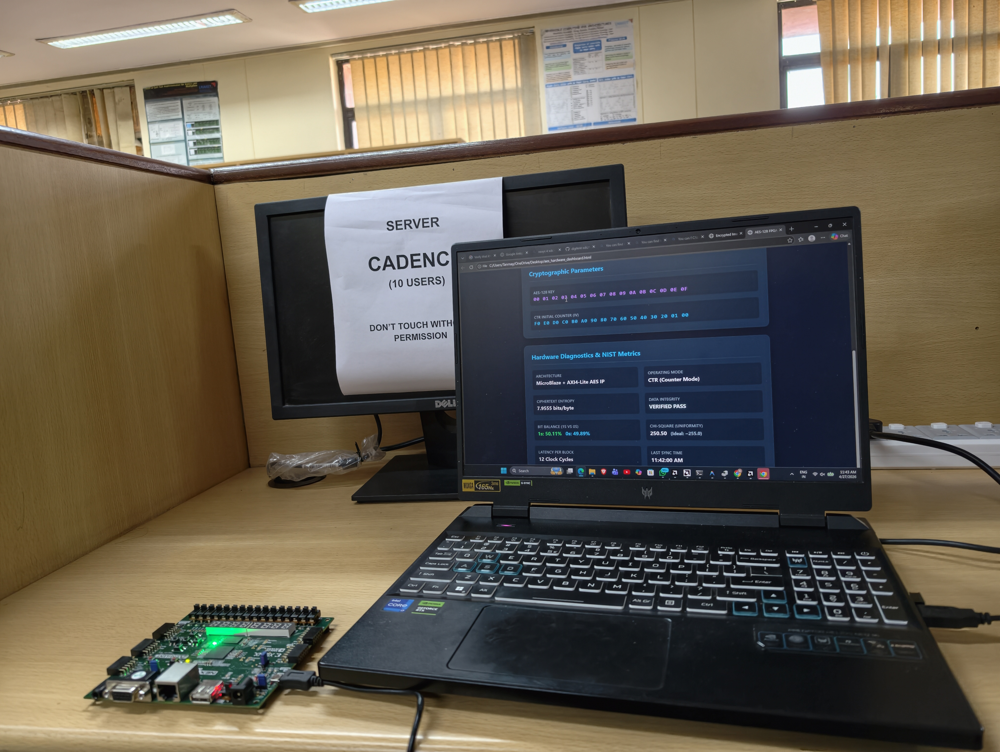
</p>
<p align="center"><em>Fig 10. Hardware diagnostics and statistical quality indicators displayed in real-time from FPGA memory</em></p>

<p align="center">
  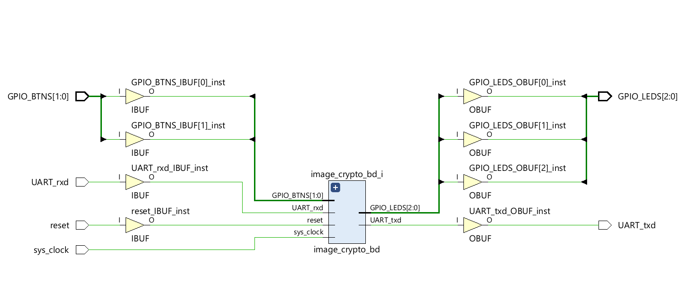
</p>
<p align="center"><em>Fig 11. Top-level RTL schematic — I/O buffers wrapping the image_crypto_bd block design</em></p>

---

## 🛠️ Troubleshooting

| Problem | Solution |
|:--------|:--------|
| TCL script fails at IP packaging | Ensure Vivado **2024.2** is used. Verify `hw/ip/aes128_axilite/hdl/` contains both `.v` files |
| `component.xml` already exists | Delete `hw/ip/aes128_axilite/component.xml` and re-run TCL |
| Synthesis error on AES core | Both files must be `.v` (Verilog-2001), not `.sv` |
| XSCT connection fails | Ensure only one JTAG client is connected. Close Vitis hardware manager if open |
| Mismatch in compare_results | Verify key/counter in `main.c` matches `software_reference_ctr.py` defaults |
| Vitis can't find `xparameters.h` | Re-export `.xsa` after any hardware changes |
| Dashboard not updating | Ensure XSCT path in `multi_image_demo.py` matches your Vitis installation |

---

## 📚 References

1. **NIST FIPS 197** — Advanced Encryption Standard (AES), November 2001
2. **NIST SP 800-38A** — Recommendation for Block Cipher Modes of Operation (CTR Mode)
3. **Xilinx UG984** — MicroBlaze Processor Reference Guide
4. **Xilinx PG078** — AXI4-Lite Interface Specification
5. **Digilent Nexys 4 DDR** — Reference Manual (xc7a100tcsg324-1)

---

## ⚖️ License

This project is released for **academic and educational purposes**. The AES-128 IP core is an original implementation based on the public FIPS-197 specification. Feel free to use, modify, and extend for research or coursework.

---

<p align="center">
  <strong>Built with ❤️ on Xilinx Artix-7 | Vivado 2024.2 | Vitis Unified IDE</strong>
</p>

<p align="center">
  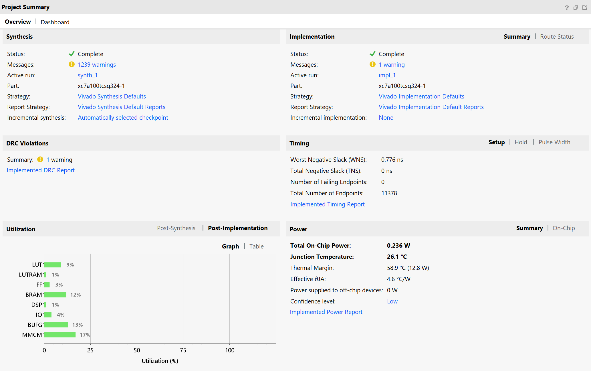
</p>
<p align="center"><em>Vivado Project Summary — Synthesis ✅ | Implementation ✅ | Timing ✅ | Power ✅</em></p>
